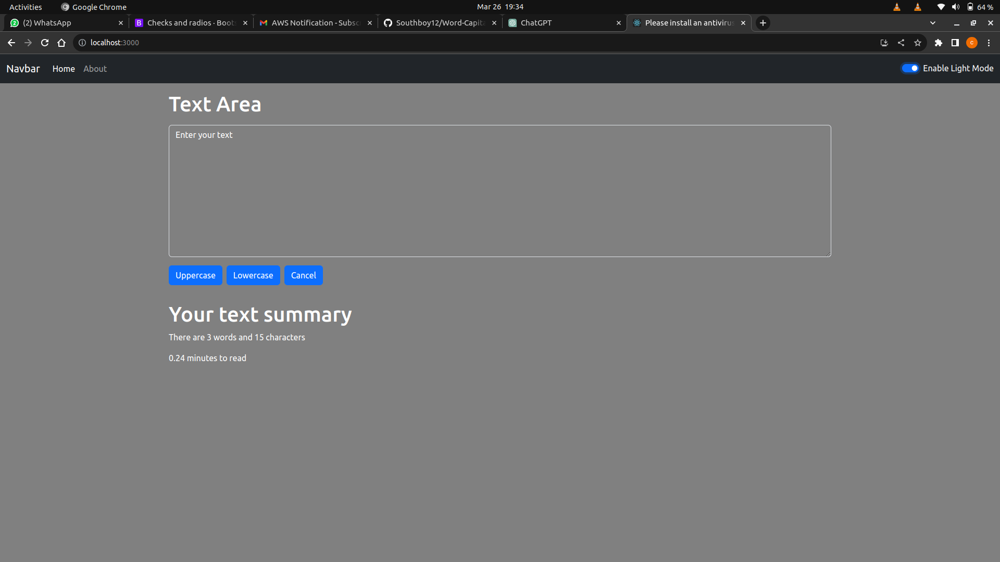

# Word Capitalizer App

The Word Capitalizer app is a versatile tool designed to assist users in manipulating the capitalization and formatting of text. Its intuitive interface provides users with various options to modify text capitalization, clear input, and transform text to lowercase. Additionally, the app offers a toggle button to switch between light and dark modes for enhanced user experience.

## Table of contents

- [Overview](#overview)
  - [Screenshot](#screenshot)
- [My process](#my-process)
  - [Built with](#built-with)
  - [What I learned](#what-i-learned)
  - [Continued development](#continued-development)

## Overview

### Screenshot

## My process

### Built with

- React
- HTML 5
- CSS 3
- Bootstrap 5
- Javascript
- Mobile-first workflow

### What I learned

Through building the Word Capitalizer webapp, I gained insights into:

**Props & PropTypes:** Efficiently passing data between components and ensuring type safety with PropTypes.
**Hooks, States, & Events:** Leveraging useState and useEffect for state management and handling user interactions.
**React Router:** Implementing navigation and routing for seamless multi-page applications.

These concepts empowered me to create dynamic, interactive, and well-structured React applications with enhanced user experiences.

### Continued development

I am committed to further honing my React skill by building more complex react applictions. 
